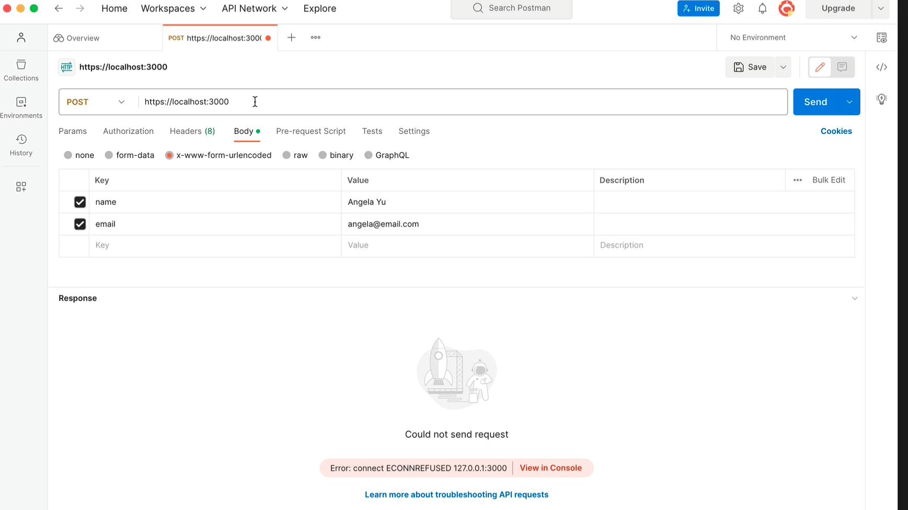

# Postman

When creating APIs / creating backends, often want to simply write the code first and get it tested so that the front-end team can do all the front end e.g. that sign up form

Create a **backend without a frontend**

Postman is a tool that professional developers use in order to test the back end API 

In Postman, you can:
- target a specific URL or an endpoint
- specify the type of request you want to make
- can set up several tabs for each request you're testing out

Postman allows you to make HTTP requests, as if you had a client-side making requests to your server. E.g. an end user on their mobile device or laptop submitting form data which would be them making a POST, PUT or PATCH request

Postman is like a little client-side simulator

When creating a simulation HTTP request on Postman, you can:

- use a dropdown menu to select the type of request
    - all the main http request methods are there such as GET, POST, PUT, PATCH, DELETE (and I can also see another couple options in the dropdown menu called HEAD and OPTIONS - to explore later)
- enter the URL / add in your endpoints
- add values to the body (i.e. adding details to the request body)

Here is an example POST request sent to https://localhost:3000 with some URL encoded form data (see selected check box that says `x-www-form-urlencoded`) added to the request body via a couple of key-value pairs. For the key "name" it's given the value "Angela Yu" and for the key "email" it's given the value "angela@email.com". So in the html form, in this example, there would be a "name" field and an "email" field for the user to input their details to sign up. The user's data would form part of the request body.

Therefore, by using Postman, we can send testing data to test out the http request-response loop of our application / website without yet having to do any of the front-end hard work.

NB. In the example image above, it does say "error, could not send request". That's because Angela did not have a port open on 3000, did not have localhost up and running with the server and didn't yet have any of the code written.

