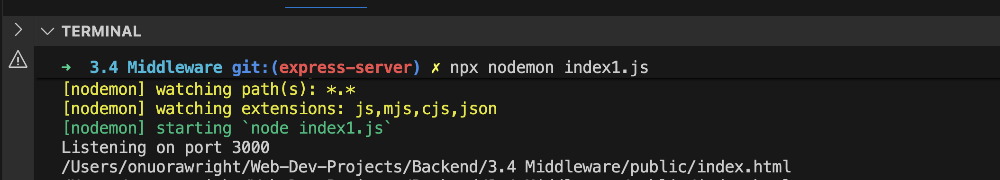
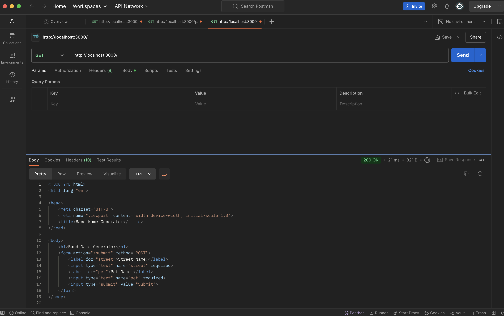
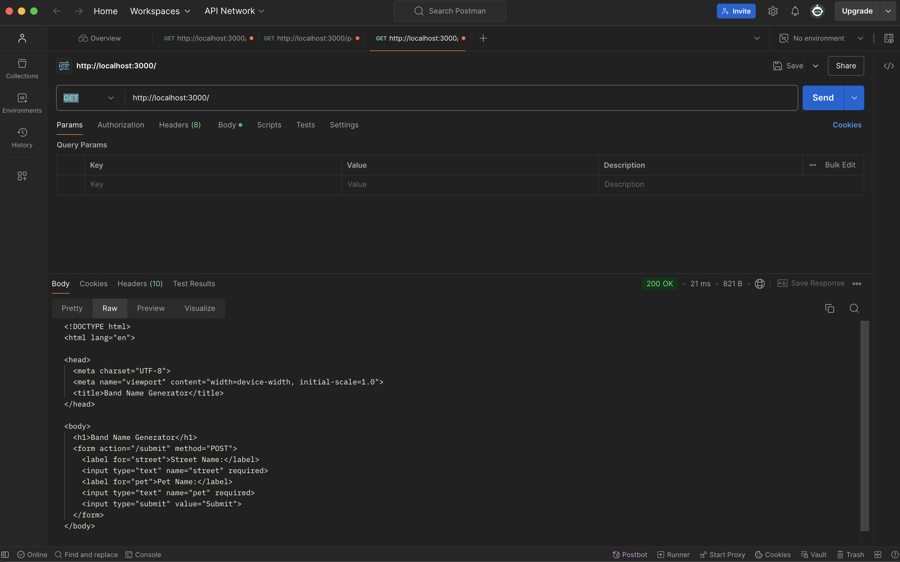
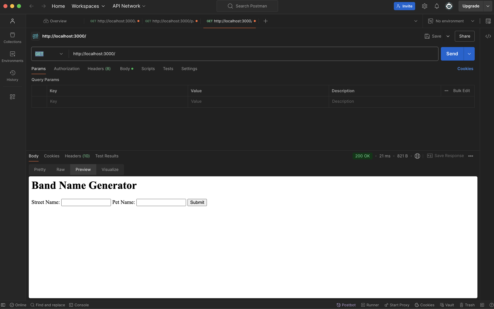
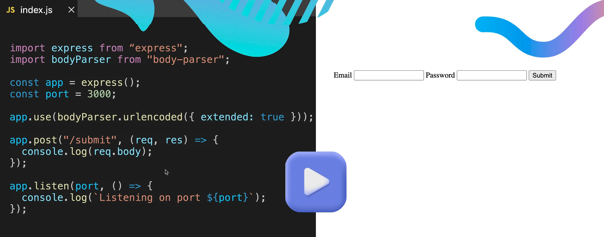

# Introduction to Middleware

Middleware is like a middleman, checkpoint **before** the server processes and responds to http requests.

When a http request from the client is sent to the server, middleware sits before the request gets processed by all of the route handlers (e.g. GET, POST, PUT, PATCH, DELETE). 

## What Middleware can do
- pre-process http requests
    - when we know that a request is going to go to multple handers (e.g. it could be processed by GET, POST or PUT), at the intermediate stage, the middleware can change aspects of the request or perform various functions on the request before it goes to its final routing
- logging the request (gathering data about the request)
    - How long did it take the request to come through?
    - What type of request was it? GET, POST, PUT, PATCH etc
    - What is the status of the request being handled?
- authentication
    - before we allow the request through to our backend handlers, we can see if that request actually came from a client that is authorised to make that request e.g. does the user have permission to make a POST request / update the company logo etc
- identify and handle errors in the request before they go through to the handlers

## HTML forms

An example of an html form

```html
  <form action="/submit" method="POST">
    <label for="street">Street Name:</label>
    <input type="text" name="street" required>
    <label for="pet">Pet Name:</label>
    <input type="text" name="pet" required>
    <input type="submit" value="Submit">
  </form>
```
### How do we incorporate the form above into our backend?
 - see [index.html](./public/index.html) and [index1.js](./index1.js) for comments and explanation

 Result of console log statement (`console.log(__dirname + "/public/index.html");`) in [index1.js](./index1.js):
 -  
 

 - Screenshots of Postman with response to GET request to homepage:
    - Response
      - 

    - Raw tab
      - 
    
    - Preview tab
      - 

Preview tab = a useful feature on Postman

## Body Parser
 
Body parser middleware is (was) an essential component in Express applications. It processes incoming request bodies, making it easier to handle POST and PUT requests. By parsing the body of an HTTP request and attaching it to the `req.body` property, it simplifies data extraction and manipulation in server-side logic.

Guide to [Understanding Body Parser Middleware in Express](https://medium.com/@AbbasPlusPlus/understanding-body-parser-middleware-in-express-ac1966c36998)

### Example use of Body Parser
Below is an example import and use of Body Parser to parse the information that's sent via a POST request coming in through an html form on our website


#### Breakdown of above example
- The index.html page contains a form
- When the `submit` button is pressed, the form is going to make a POST request (including all the user input data)
- The POST request is to the path specified (in this case `\submit`)
- We need a route handler that is able to handle a POST request to that particular path (`\submit`)
- We use body parser middleware to **parse** the information that comes in from the html form
- We add that data to the request object so we can actually `console.log()` it under `req.body`

**Parse Definition**
In computer science, parsing is a technique used to analyze and interpret the syntax of a text or program to extract relevant information. Essentially, parsing involves **breaking down a complex set of data structures or code into smaller, more manageable components that can be analyzed and understood**
Easy way to remember *parse* sounds like *parts* and essentially it is breaking complex information into digestible bitesize chunks or parts.

## Body Parser now deprecated?

Google AI overview of whether or not people still use Body Parser

People do use body parsing functionality, as it is essential for handling data from HTTP POST, PUT, and PATCH requests (such as form submissions or API requests). 

However, developers typically **no longer use the separate body-parser package directly** when working with modern Express.js applications. 

### Current Usage in Express.js

Since Express version 4.16.0+, the necessary body parsing middleware is built directly into the core express package. This means you don't need to install a separate dependency. Instead, developers use the built-in `express.json()` and `express.urlencoded()` functions, which are essentially the same underlying functionality as the old `body-parser` package.

### Modern approach (preferred):

```js
const express = require('express');
const app = express();

// Middleware to parse JSON bodies (common for APIs)
app.use(express.json()); 

// Middleware to parse URL-encoded form data
app.use(express.urlencoded({ extended: true }));

```
This setup automatically parses the incoming request body and makes the data available in `req.body` within your route handlers. 

### Why is it used?
Without a body parser, the incoming request body is a raw data stream, which is difficult and tedious to handle manually. The middleware simplifies this process by: 
- **Parsing data formats:** It understands and converts common formats like JSON, URL-encoded form data, and plain text into usable JavaScript objects.

- **Populating `req.body`:** It attaches the parsed data to the req.body property, allowing developers to easily access information like user input.

- **Saving development time:** It saves developers from writing many lines of code to manually buffer and parse the raw request stream for every route that accepts data. 

In summary, the functionality of body-parser is still very much in use and is a fundamental part of most web applications that accept user input or API data, but it is now integrated into the main Express framework for convenience. 

## Copilot's guidance for completing exercise 1 due to outdated course material (Body Parser)

### Step-by-Step Guide to Complete Exercise 1

#### Step 1: Add the Body Parsing Middleware
After you create your `app` variable (around line 16 in your current `index1.js`), you need to add the middleware that will parse incoming form data.

Add this line:
```js
app.use(express.urlencoded({ extended: true }));
```
**Where to place it:**

- After `const app = express();`
- Before your route handlers (before `app.get("/", ...)`)

**What this does:**

- `app.use()` tells Express to use middleware for all incoming requests
- `express.urlencoded()` is the built-in middleware that parses URL-encoded form data (the type of data HTML forms send by default)
- `{ extended: true }` allows for rich objects and arrays to be encoded into the URL-encoded format (it uses a library called qs under the hood for more complex parsing)

**Why you need this:**

- When someone submits the form in `index.html`, the browser sends the data in a special format called "URL-encoded"

- Without this middleware, `req.body` would be `undefined` and you wouldn't be able to access the form data

-This middleware intercepts the request, parses the data, and attaches it to `req.body`

***

#### Step 2: Create a POST Route Handler

Your `index.html` form has this line:

```js
<form action="/submit" method="POST">
```

This means when the user clicks submit, the browser will make a POST request to the `/submit` route.

You need to create a route handler to catch this POST request.

Add this code after your `app.get("/", ...)` route and before `app.listen()`:


```js
app.post("/submit", (req, res) => {
  console.log(req.body);
});
```

**Breakdown:**

- `app.post()` creates a route handler specifically for POST requests (not GET requests)
- `"/submit"` is the path that matches the `action` attribute in your HTML form
- `(req, res) => {}` is the callback function that runs when someone makes a POST request to `/submit`
- `req.body` is where the parsed form data will be available (thanks to the middleware you added in Step 1)
- `console.log(req.body)` will print the form data to your terminal/console so you can see what was submitted

**What you'll see:**

When you submit the form with "street" and "pet" inputs, `req.body` will look something like:

```js
{ street: 'Baker Street', pet: 'Fluffy' }
```
*** 

#### Step 3: Test Your Implementation
1. Make sure nodemon is running (`npx nodemon index1.js`)
2. Open your browser and go to `http://localhost:3000`
3. Fill out the form with a street name and pet name
4. Click Submit
5. Check your terminal where nodemon is running—you should see the form data logged as an object

***

#### Summary of What You're Adding

Your `index1.js` will have these key components:

1. **Imports** (already there)
2. **App and port setup** (already there)
3. **Middleware** ← NEW: `app.use(express.urlencoded({ extended: true }));`
4. **GET route** (already there—serves the HTML form)
5. **POST route** ← NEW: `app.post("/submit", ...)` to handle form submission
6. **Server listening** (already there)

*** 

#### Comparison with the Old Way

**Old way (deprecated):**
```js
import bodyParser from "body-parser";
app.use(bodyParser.urlencoded({ extended: true }));
```
**New way (modern):**
```js
// No import needed—it's built into express!
app.use(express.urlencoded({ extended: true }));
```

The functionality is identical, but now it's cleaner and doesn't require an extra package installation.

***

**Common Gotchas to Avoid**
1. **Order matters:** Make sure `app.use(express.urlencoded(...))` comes BEFORE your route handlers
2. **Don't forget `extended: true`:** Without it, you'll get less flexible parsing
3. **Match the route paths:** Your form's `action="/submit"` must match your `app.post("/submit", ...)`
4. **Check the method:** Your form uses `method="POST"`, so you need `app.post()`, not `app.get()`


